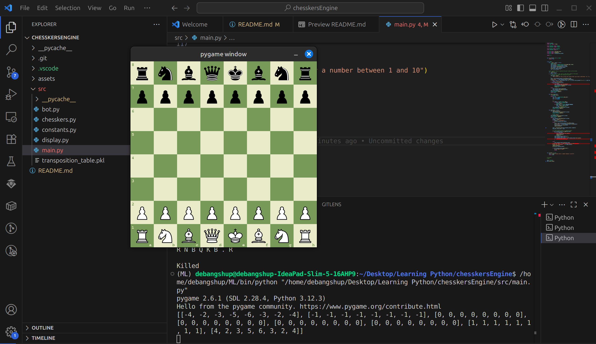
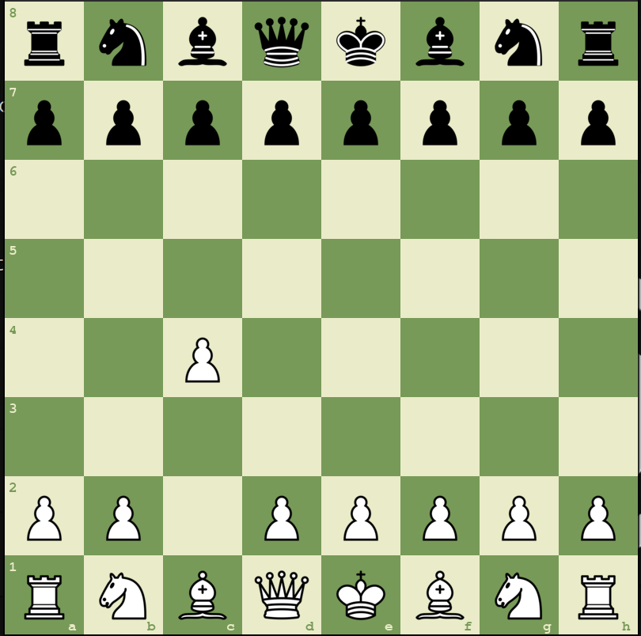
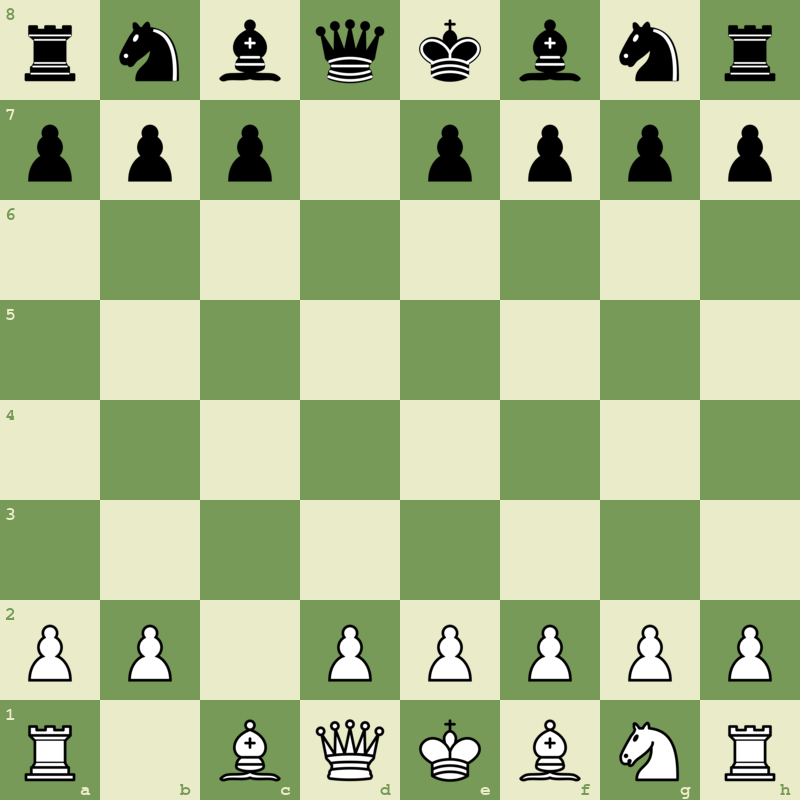

# Chesskers API
The Chesskers API is a full python implementation of the University High School original chesskers: a chess variant that mixes the mechanics of chess with the movement of chesskers. 

## Chesskers: the Game
Essentially, while captures are not in play, chess continues
to function in its usual manner: as if nothing is different. The fun starts, though,
when pieces are captured. Just like in checkers, more than one piece can be captured 
every turn. 
For a more detailed explanation of how this variant works, do take a look
at Cole's blog: https://kirawano.github.io/writings/chesskers.html 
It illustrates how/when a move is possible, and gives clear images as to how captures work. 

## Important Functionality
This project is an example of how python can be used to create a particular variant of 
chess. Every part of this project is sample code which shows how to do the following:
* Create a graphical chessboard using individual images for every square and piece
* Create a bit-board/alphanumeric representation of a chessboard 
* Implement minimax; optimized with alpha-beta pruning to eliminate some branches of the move tree to speed up computations 
* Utilize recursion to evaluate potential future positions that could arise
* Utilize Object-Oriented-Programming to create a chessboard and generate moves
* Use the pathos.multiprocessing library to utilize threads for faster computation

## Installation 
To smoothly install and run this project, be sure that you have python3 installed. Then, the recommended way to store the necessary python libraries for this project is to create a virtual environment by opening the terminal (having installed python3) then running the following code, with your desired environment name. 
```
python3 -m venv <ENVIRONMENT_NAME>
```
Then, go into that environment using the following command: 
```
source <ENVIRONMENT_NAME>/bin/activate
```
Finally, while most libraries that are used in this project come in the basic installation of python, there are 2 exceptions: pygame and pathos. To install them, run both of the commands below: 
```
pip install pygame
```
```
pip install pathos
```
Finally, now that all the required dependencies are installed by this point, any user can simply run our program by cloning our repository into theirs, using the `git clone` command inside the new repo. Here is the full command below: 
```
git clone https://github.com/CrustyKnight/chesskersEngine.git
```

## Post-Installation: Necessary Knowledge & Caveats
Because our engine is prone to lagging because of the jump-chain nature of chesskers, it can only run reliably at depth 1 (i.e., it can see what move is best for itself, without seeing the opponent's best reply). If some lagging can be tolerated, then the engine can also run on depth 2 (now it sees the best move based on the fact that it can also see the opponent's next (and most probable) moves). 
* The depth argument can be found on `line 92` of `main.py` in the `src` directory, and it can be altered there. 
We believe that the reason for this lag is because of the inherent slowness of python. Sam, however, ported this program to common lisp, which can be accessed here: https://github.com/CrustyKnight/cl-chesskers-engine. That version, although with functional programming instead of object-oriented, does not have such lag problems. If we can find optimizations in the future, we will implement them. 
* If you want to play against a friend (instead of against an engine), then just go to `line 128` of `main.py` in the `src` directory and replace `main.pve()` with `main.main_loop()`. To revert to player versus engine mode, j
Nevertheless, for the purpose of minimizing lag, the moves we enter are in Universal Chesskers Notation (UCN). If you are unfamiliar with this notation, check out Cole's blog, which is once again: https://kirawano.github.io/writings/chesskers.html 

## Post-Installation: Demonstrating moves
Once you open up the program after cloning it, just press the run button, and the program will start running. Keep in mind, it will only stop if either the game ends or if the quit button (red circle with white `x`) in the top right corner is clicked. After that, to move pieces, (just moving, not capturing), just list the start square and end square of the piece. 
* For example, here is the starting board, as visible when the pygame window opens, along with the terminal: 
* Then, let us type the move `c2c4` into the terminal. Then, upon pressing the enter key and clicking on the GUI board, this is what the board looks like this: 
    * Here, if you look carefully along the left and bottom edge squares, you can see the alpha-col labels of the board, and then see that `c2c4` means that the piece from `c2 -> c4`. 
    * Note: to cancel this move, just don't click on the board, and enter 'no' into the terminal after having unintentionally entering it in. 
* Now, it's black's turn. Black could also move a piece, but black as a series of captures. Black can play the move `b8d7td6|d6c4tc3|c3b1tb8`, which is a series of 3 jumps. Let's break down what each jump does...
    * `b8d7td6` means that the piece ON `b8` (that knight) took the piece (black pawn) on `d7` to `d6`. Visualize on the board above what this would look like. 
    * Similarly, `d6c4tc3` means that the piece on `d6` (now the knight) took the piece (white pawn) on `c4` then landed on `c3`. Note that it could've also landed on `b4`: try and find out why. 
    * Finally, `c3b1tb8` means that the knight from `c3` took the piece on `b1` then landed back on on `b8`, marking the end of a turn as the edge was crossed, from b1 to b8. This is what Cole calls a "closet edge", in his nice and handy blog. 
    * This would be the resulting board: 
        * If none of this still makes sense, then please give Cole's blog a [nice, long, legitimate read](https://kirawano.github.io/writings/chesskers.html)
* The game keeps going until one of the sides loses their king, or until a draw is reached by either threefold repetition or 50-move rule (look those up for chess, they're the exact same for chesskers)
* Good luck, and have fun!

## Contributors
- [ByteBangshu](https://github.com/ByteBangshu) (committed through suchidi22 account)
- [CrustyKnight](https://github.com/CrustyKnight)
- [kirawano](https://kirawano.github.io)


